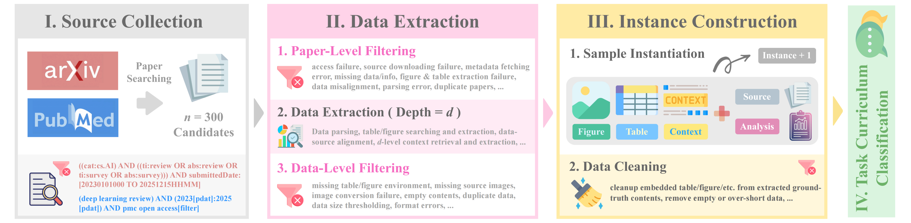

# **ANAGENT For Enhancing Scientific Table & Figure Analysis**

<div align="center">

[](https://xhguo7.github.io/Anagent/)
[](https://arxiv.org/abs/2602.10081)
[](https://github.com/xhguo7/Anagent)
[](https://huggingface.co/xhguo7)

</div>

---

## 📊 **ANABENCH: Benchmarking Scientific Table & Figure Analysis**

**ANABENCH** is a large-scale benchmark featuring **63,178 instances** from **9 scientific domains** and **170 fine-grained subdomains**, systematically categorized along **7 complexity dimensions** to evaluate scientific table and figure analysis capabilities.

<div align="center">

</div>

### **Key Features**

- **📈 63,178 Instances** across diverse scientific domains
- **🔬 9 Broad Domains**: Computer Science, Electrical Engineering, Mathematics, Physics, Economics, Quantitative Biology, Quantitative Finance, Statistics, Biomedicine
- **🎯 170 Fine-grained Subdomains** for more comprehensive coverage
- **📐 7 Complexity Dimensions**: Type, Domain, Format, Source, Width, Depth, Objective

### **Complexity Dimensions**

1. **Type**: Tables, figures, or combined multimodal content
2. **Domain**: 9 broad scientific fields with 170 specialized subdomains
3. **Format**: LaTeX, XML, and other representations
4. **Source**: General research papers vs. review & survey papers
5. **Width**: Self-contained, internal, external, or mixed reference scope
6. **Depth**: Shallow description vs. in-depth inferential analysis
7. **Objective**: Methodology-oriented vs. experiment-oriented analysis

---

## 🌟 **ANAGENT: Multi-Agent Collaborative Scientific Analysis**

**ANAGENT** is a multi-agent framework that simulates human research workflows through four specialized agents working collaboratively to perform high-quality scientific table and figure analysis.

<div align="center">

</div>

### **Specialized Agents**

- **🎯 PLANNER**: Decomposes complex tasks into actionable subtasks and provide task-oriented planning guidance
- **🔍 EXPERT**: Performs iterative knowledge acquisition through specialized tool execution and targeted retrieval
- **🖋️ SOLVER**: Synthesizes accumulated knowledge to generate coherent, context-aware analysis solutions
- **📈 CRITIC**: Assesses analysis quality through five-dimensional evaluation and provides targeted refinement feedback

---

## 🛠️ **1. Experiment Setup**

### Installation

```bash
# Coming soon
```

---

## 🚀 **2. Quick Start**

```bash
# Coming soon
```

---

## 📈 **3. Modular Optimization**

### **Supervised Finetuning**

```bash
# Coming soon
```

---

## 📝 Citation

If you find this work useful, please kindly cite:

```bibtex
@article{guo2026anagent,
  title={ANAGENT For Enhancing Scientific Table & Figure Analysis},
  author={Guo, Xuehang and Lu, Zhiyong and Hope, Tom and Wang, Qingyun},
  journal={arXiv preprint arXiv:2602.10081},
  url={https://arxiv.org/abs/2602.10081},
  year={2026}
}
```

---

<div align="center">

© 2026 | College of William & Mary, Allen Institute for AI, NIH

🥰 Thanks much for your interest!

</div>